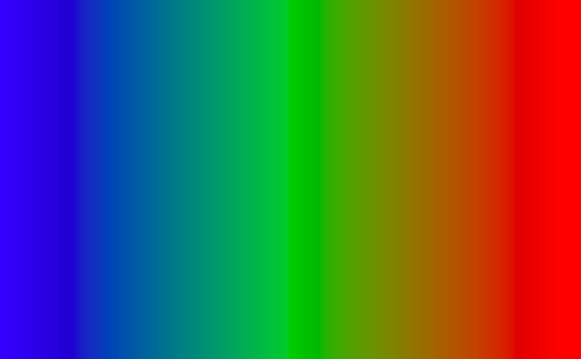

# Spectrum

Open source library for creating full RGB Spectrum jpg images.<br>
Simply copy the source and header files from this project into your own and include with: 
```cpp
include "Spectrum.h"
```

## Usage

To create the RGB jpg call the function:<br>
```cpp
Spectrum::createSpectrum(int width, int height, const char* output)
```

Where <strong>output</strong> is the out file where the jpg will be saved



## Contributions
All contributions and new features are very welcomed, feel free to fork!